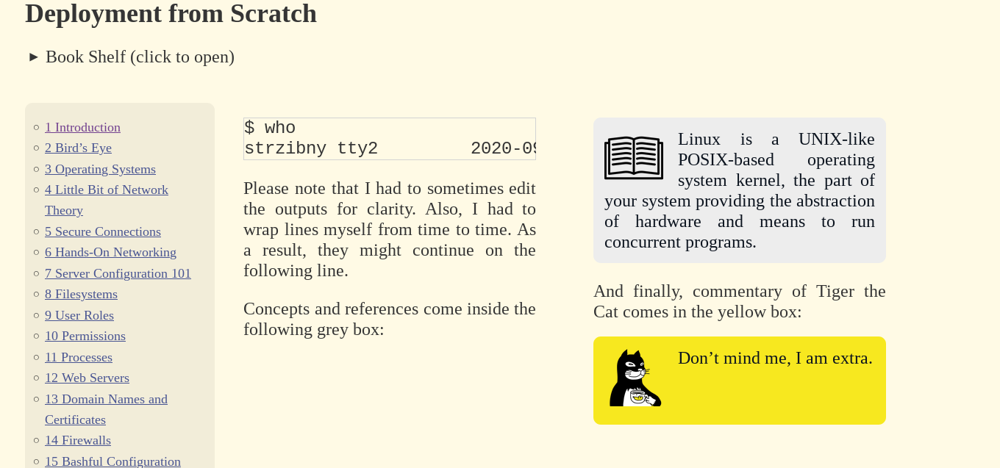
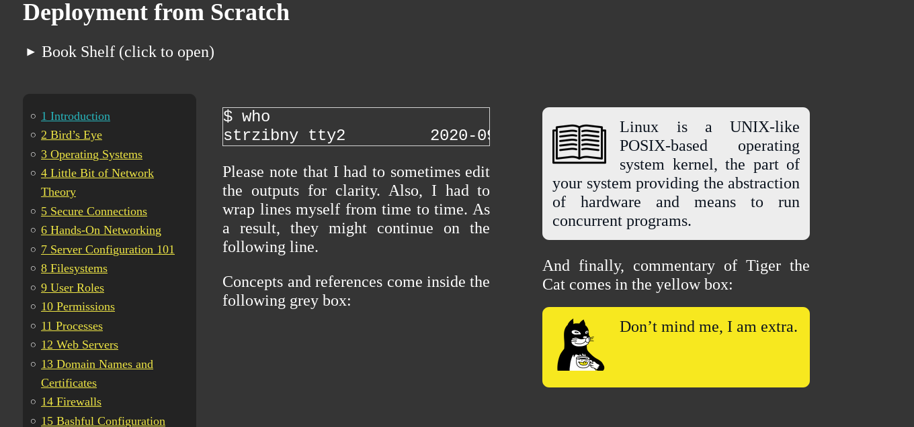

# Bookshelf

Epub reader powered by [epub.js](https://github.com/futurepress/epub.js)

Start an HTTP server (ruby by default) to serve local files and let epub.js kick in to load & render
the books.

You can generate the book list dinamycally by creating the file `index.html.erb` (example included):

```sh
$ cp index.erb index.html.erb
$ ./run.rb
```

You can specify which books you want to serve or find them automatically in the directory each time
you run the program.

## Screenshots




